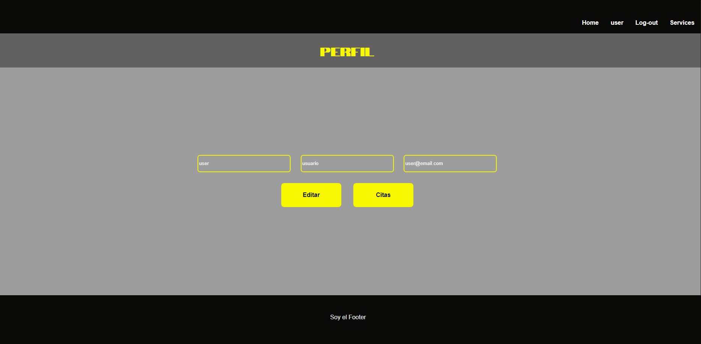

# Ract Frontend: Old Ink
  

Welcome to the Old Ink's frontend api documentation. This api recreates a fictional website of a tatto studio. This project is the frontend of [backend_services](https://github.com/ariusvi/backend_services) project.

---
    

# Contenido 📂
  <ol>
    <li><a href="# About the project 🎨">About the project 🎨</a></li>
    <li><a href="# Stack ⚓">Stack ⚓</a></li>
    <li><a href="# Local installation 💻">Local installation 💻</a></li>
    <li><a href="# Roots 🔗">Roots 🔗</a></li>
    <li><a href="# Bugs 🐜">Bugs 🐜</a></li>
    <li><a href="# Cool detail 🎉">Cool detail 🎉</a></li>
    <li><a href="# Future features ✨">Future features ✨</a></li>
    <li><a href="# Author ✒️">Author ✒️</a></li>
    <li><a href="# Acknowledgements 🙏">Acknowledgements 🙏</a></li>
    </ol>

# About the project 🎨
This project is the frontend part of a fictional tattoo studio. React has been mainly used. This project connects to a MySQL database from project [backend_services](https://github.com/ariusvi/backend_services).

On the Home page we find a small description of the tattoo studio, as well as the registration buttons (which redirects the user to the registration area) and the services button (which redirects the user to the services area that are performed in the tattoo studio. tattoos)
At the top, we find a header that is the navigation bar with the buttons: Home, Login and Register, which redirect the user to the different pages of the website.

In the Login area, the user can log in through a form. Once the user has been logged in, the login header changes to the user's name and if clicked redirects to said user's profile.
In the profile, the user can edit the data: name, surname and email. Additionally, you can access the appointment area, through the appointment button.

On the appointments page, the user can view and delete their upcoming appointments as well as create a new appointment.


# Stack ⚓
<div align="center">
<a href="https://www.reactjs.com/">
    
</a>
<a href="https://developer.mozilla.org/es/docs/Web/JavaScript">
    
</a>
</a>
<a href="">
    
</a>
<a href="https://nodejs.org/es/">
    
</a>
<a href="">

</a>
<a href="">
    
</a>
<a href="">
    
</a>
<a href="">
    
</a>
<a href="">
    
</a>
<a href="">
    
</a>
<a href="">
    
</a>
<a href="">
    
</a>
<a href="">
    
</a>
<a href="">
    
</a>
 </div>

 # Local installation 💻
 ## Backend
 - Go to: [backend_services](https://github.com/ariusvi/backend_services)
1. Clone the repository
 ` $ git clone https://github.com/ariusvi/backend_services `
2. Install dependencies
 ``` $ npm install --y ``` 
3. Start Express on the server
 ``` $ npm run dev ```
4. Run migrations
 ``` $ npm run run-migrations ``` 

## Frontend
1. Clone the repository
 ` $ git clone https://github.com/ariusvi/react_tattoostudio `
2. Install dependencies
 ``` $ npm install --y ``` 
3. Start Express on the server
 ``` $ npm run dev ```

 ## Users credentials
- User
```json
id: "1",
first_name: "user",
last_name: "user_apellido",
email: "user@email.com",
password: 123456,
role: "user"
```
- Admin
```json
id: "2",
first_name: "admin",
last_name: "admin_apellido",
email: "admin@email.com",
password: 123456,
role: "admin"
```
- Super_admin
```json
id: "3",
first_name: "super_admin",
last_name: "superadmin_apellido",
email: "superadmin@email.com",
password: 123456,
role: "admin"
```

# Roots 🔗

1. Home  

  


2. Login  

  


3. Register  

  


4. Services  

  


5. Profile  

  


6. Appointments

  


7. super_admin Profile


8. superadmin access


# Bugs 🐜
- There isn't time restriction at Appointments, user only choose a date
- Services are choosen by ID, not by name.

# Cool detail 🎉
Loading gif created with [ldrs library](https://uiball.com/ldrs/)


# Future features ✨
- Date and time restrictions when create an appointment
- Ability to modify service and date in an already scheduled appointment
- Allow super admin to create and modify services
- Responsive design
- Deploy backend and frontend
- Design a footer

# Author ✒️
* Ana Rius 
    * [GitHub](https://github.com/ariusvi)

# Acknowledgements 🙏
Thanks to my classmates:<br>
Pedro for his patience and help, especially to confirm that I understand things.<br>
Marina and Marta for her moral support, joint laughter and tears, as well as her help.<br>